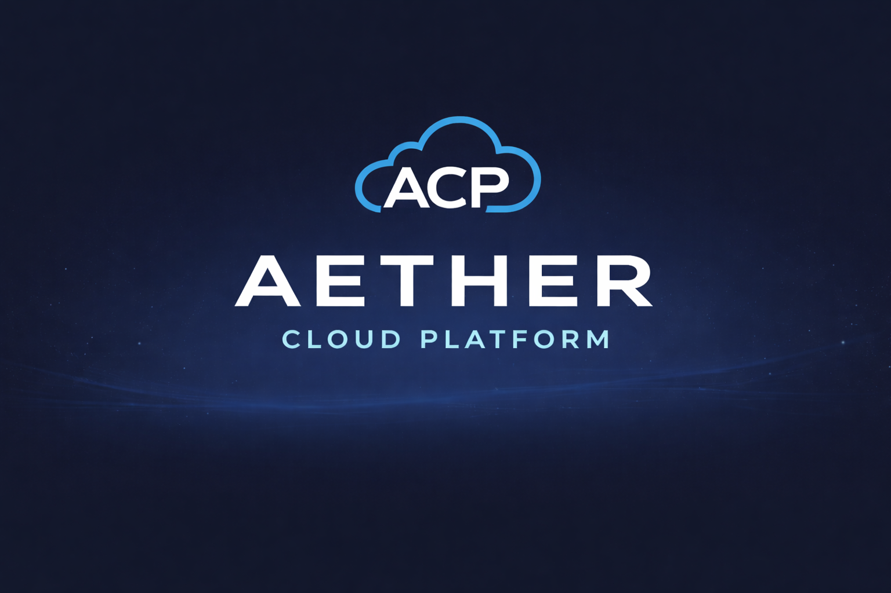
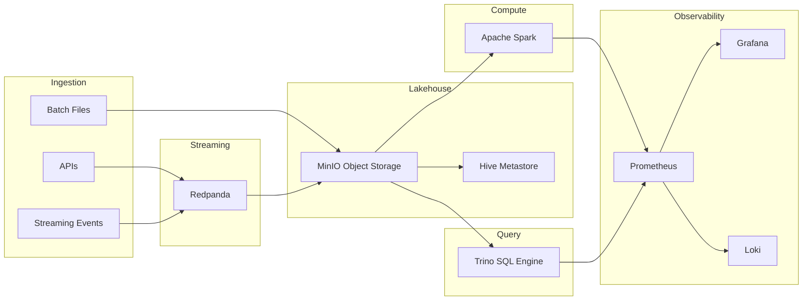

***
# AETHER Cloud Platform (ACP)
***

<p align="center">  </p> <p align="center"> <strong>A Local Cloud-Native Data Platform</strong> Build, test, and run modern data infrastructure on your laptop. </p> <p align="center">
</p>


---


## What is AETHER Cloud Platform?

AETHER Cloud Platform (ACP) is a local cloud-style data platform designed to replicate the architecture of modern data infrastructure stacks.

Instead of learning tools in isolation, ACP connects them into a complete collective ecosystem:

• Object storage lakehouse
• Real-time streaming
• Distributed compute
• SQL query federation
• Observability stack
• CLI orchestration

Think of it as:

**A miniature AWS + Snowflake + Kafka + Databricks running locally.**

ACP is the foundation layer for future systems I have planned like:

| System              | Purpose                             |
| ------------------- | ----------------------------------- |
| **ODIN**            | Aviation data streaming and analytics |
| **CHRONOS**         | Smart meter simulation platform     |
| **Arachne-Spark**   | Graph data fraud detection platform |


---

## Platform Architecture



---


## Platform Components


| Layer         | Technology         | Purpose                      |   
| ------------- | ------------------ | ---------------------------- |
| Storage       | **MinIO (S3)**     | Lakehouse object storage     | 
| Metadata      | **Hive Metastore** | Table metadata               |
| Streaming     | **Redpanda**       | Kafka-compatible streaming   |
| Compute       | **Apache Spark**   | Distributed data processing  |
| Query         | **Trino**          | Federated SQL engine         |
| Database      | **Postgres**       | Platform metadata + services |
| Monitoring    | **Prometheus**     | Metrics collection           |
| Dashboards    | **Grafana**        | Visualization                |
| Logging       | **Loki**           | Centralized logs             |
| Orchestration | **Docker Compose** | Infrastructure runtime       |
| CLI           | **Typer (Python)** | Platform command interface   |


---

## Core Design Principles

ACP is designed like a real data platform.

#### Lakehouse Architecture

- Bronze  → Raw ingestion
- Silver  → Cleaned / structured
- Gold    → Analytics ready

**Data is stored in S3-style object storage (MinIO)**

---

#### Streaming and Batch Pipelines

ACP supports both:

- Streaming pipelines (RedPanda)
- Batch pipelines (Spark)

This emulates real production systems.

---

#### Observability

Modern platforms need visibility.

Therefore, ACP includes a full monitoring stack: 

| Tool       | Role       |
| ---------- | ---------- |
| Prometheus | metrics    |
| Grafana    | dashboards |
| Loki       | logs       |


Example metrics:

- streaming throughput
- storage usage
- query latency
- service health


---

#### CLI Driven Platform

ACP is controlled via a **clean command line interface.**

Example:

```bash
aether up
aether status
aether down
```

This is reminicient of real industry tools such as:

- aws
- kubectl
- dbt

---

## Quick Start

#### Clone Repository

```bash
git clone https://github.com/Alexander-Kershaw/aether-cloud-platform.git

cd aether-cloud-platform
```

#### Configure Environment

```bash
cp env.example .env
```

#### Start ACP

```bash
aether up
```

ACP will launch the full stack:

- MinIO
- Redpanda
- Spark
- Trino
- Postgres
- Prometheus
- Grafana
- Loki
- Hive Metastore

---

## ACP CLI Commands


| Command                  | Description    |
| ------------------------ | -------------- |
| `aether up`     | Start platform |
| `aether down`   | Stop platform  |
| `aether status` | Check services |

More commands documented in:

docs/cli_manual.md


---

## Service Endpoints

| Service | URL |
|------|------|
| MinIO Console | http://localhost:9001 |
| Grafana | http://localhost:13000 |
| Redpanda Console | http://localhost:18080 |
| Spark UI | http://localhost:18081 |
| Trino | http://localhost:18089 |
| Prometheus | http://localhost:19090 |

---

## Project Status

AETHER Cloud Platform is currently under active development.

### Working Components

- Docker-based platform orchestration
- MinIO lakehouse object storage
- Redpanda streaming platform
- Spark compute environment
- Platform CLI (`aether`)
- Initial data pipeline (ODIN aviation analytics)

### Recently Implemented

- Spark ingestion helper
- Bronze → Silver → Gold pipeline structure
- Gold analytics dataset generation
- Airflow orchestration integration
- CLI data inspection tools

### In Progress

- Trino query layer integration
- Additional pipelines
- Platform observability dashboards
- Expanded CLI capabilities
---


## Why This Project Matters

AETHER Cloud Platform demonstrates how modern data infrastructure is built:

• Streaming ingestion  
• Lakehouse storage  
• Distributed compute  
• Federated SQL  
• Observability and monitoring  

Rather than isolated tutorials, ACP shows **how the components integrate into a cohesive platform architecture.**

---


## Development Log

ACP is developed incrementally with milestone-based development logs.

Major architectural updates and implementation details can be found in:


docs/devlog/

Each devlog documents:

- architectural decisions
- infrastructure changes
- pipeline implementations
- debugging and fixes
