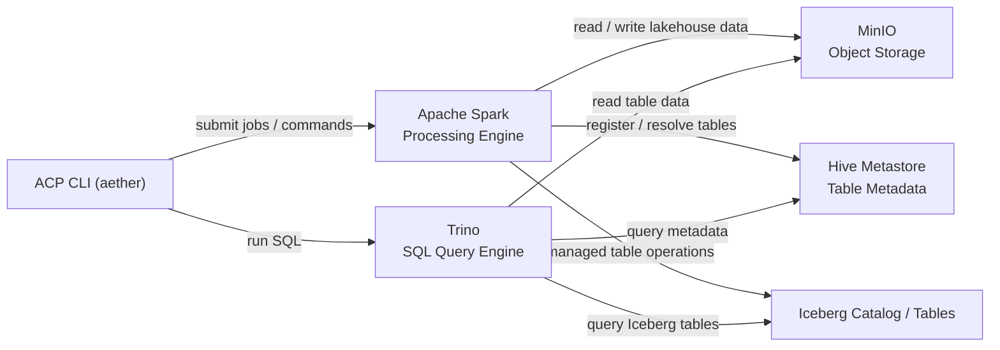
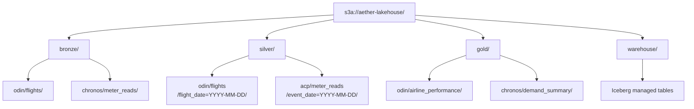
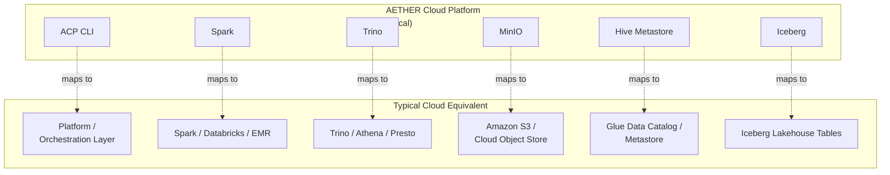
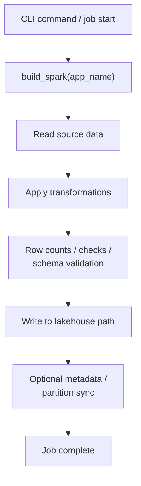
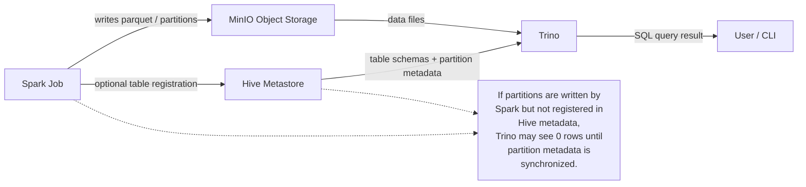
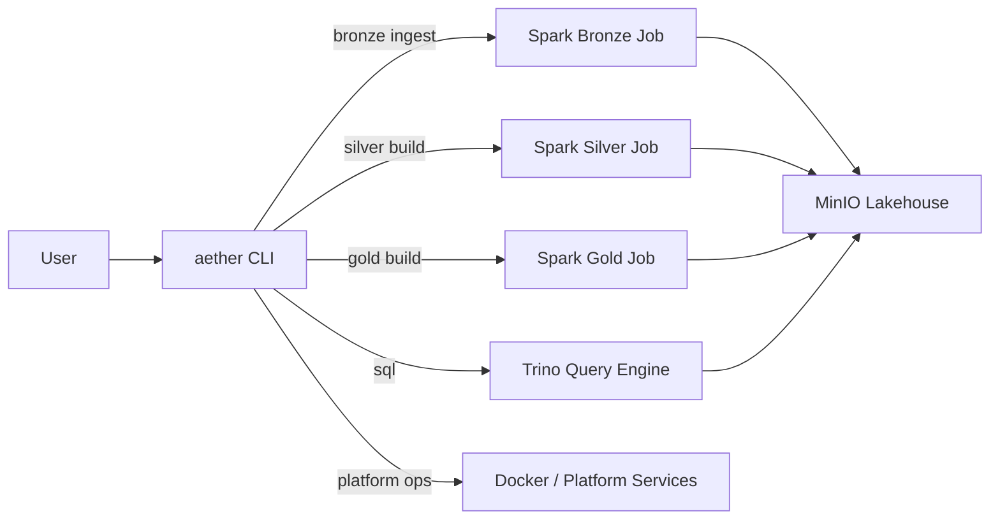
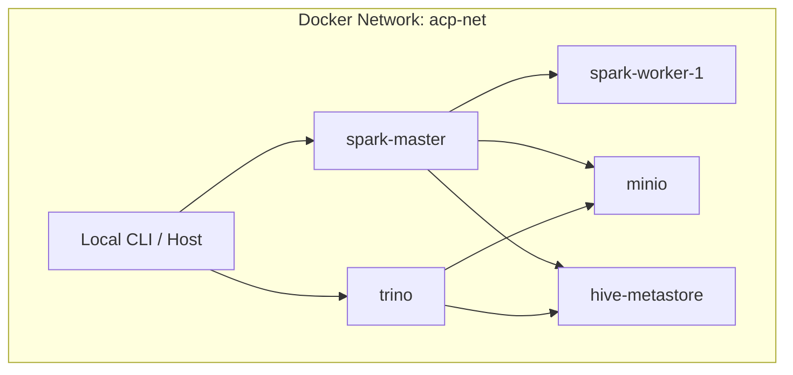
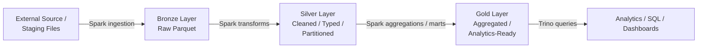
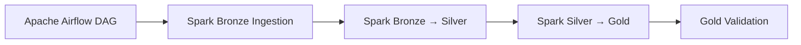
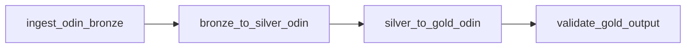

***
# Aether Cloud Platform (ACP) - Architecture
***

### Architectural Philosophy
The Aether Cloud Platform (ACP) is a **local cloud-native data platform** designed to emulate the architecture of modern production data systems used by companies such as Netflix, Uber, and Airbnb.

ACP demonstrates how raw data flows through a lakehouse architecture in a pipeline running end-to-end from ingestion to analytics showing architectural and operational patterns used in real large scale data platforms.

ACP integrates distrubuted computation, object storage, streaming infrastructure, and a SQL query engine into a single reproducible environment.

### Core Architectural Components

ACP follows several key architectural principles:

**Separation of compute and storage**

Data is stored in object storage (MinIO) while compute engines such as Spark and Trino access the data independently.

**Layered data architecture**

Data flows through structured stages: Bronze, Silver, and Gold.

Each stage represents increasing levels of structure, validation, and analytical value.

**Engine specialization**

Different engines are used for different tasks:

| Engine         | Role                                             |
| -------------- | ------------------------------------------------ |
| Spark          | Data processing, transformations, ingestion      |
| Trino          | SQL analytics and query engine                   |
| MinIO          | Object storage (S3 compatible lakehouse storage) |
| Hive Metastore | Table metadata catalog                           |
| Iceberg        | Modern table format for managed tables           |

**CLI-driven orchestration**

The ACP CLI (`aether`) acts as the control interface for the platform, enabling operations such as:

* dataset ingestion
* SQL querying
* job orchestration
* platform control

---

### High Level Architecture

ACP simulates a modern cloud data platform locally using containerized services.




In this architecture:

* **Spark** performs transformations and data ingestion
* **MinIO** stores the lakehouse data
* **Hive Metastore** tracks table metadata and partitions
* **Trino** provides SQL query access
* **CLI** orchestrates platform operations

---

### Storage Architecture

ACP uses **MinIO** as an S3-compatible object store to simulate cloud data lake storage.

All datasets follow a structured lakehouse layout.

Below is an example of the ACP storage architecture supporting and data for proposed future projects: ODIN (flight data analytics), and CHRONOS (Smart meter energy demand simulation).



### ACP Cloud Mapping



### Bronze Layer

The raw ingestion layer.

Characteristics:

* minimally transformed
* append-oriented
* schema close to source
* stored as Parquet

Example:

```
bronze/
  odin/
    flights/
      part-000.parquet
```

Bronze datasets represent the **raw landing zone** of the platform.

---

### Silver Layer

Structured and cleaned datasets.

Characteristics:

* validated schema
* standardized naming
* enriched metadata
* partitioned datasets

Example:

```
silver/
  odin/
    flights/
      event_date=2026-03-02/
         part-000.parquet
```

Silver data is optimized for **reliable downstream analytics**.

---

### Gold Layer

Aggregated and analytics-ready datasets.

Characteristics:

* business metrics
* aggregated views
* optimized for dashboards and BI
* partitioned or materialized datasets

Example:

```
gold/
  odin/
    airline_performance/
      event_date=2026-03-02/
```

Gold datasets represent **consumption layer data**.

---

### Metadata Architecture

ACP uses a **Hive Metastore** to store metadata about tables and partitions.

The metastore tracks:

* table schemas
* partition structure
* storage locations
* table formats

Example table definition:

```
raw.silver.sample_events
```

Metadata allows query engines such as Trino to discover datasets stored in object storage.

---

### Table Formats

ACP supports two table interaction models.

## Hive-style external tables

Used for simple Parquet datasets.

Characteristics:

* external storage locations
* partition discovery required
* compatible with Trino and Spark

Example:

```
external_location='s3a://aether-lakehouse/silver/acp/sample_events/'
```

Partition metadata may require synchronization:

```
CALL system.sync_partition_metadata(...)
```

---

### Apache Iceberg tables

ACP also supports **Iceberg** for modern table management.

Iceberg provides:

* schema evolution
* atomic transactions
* snapshot versioning
* time travel queries

Iceberg tables are stored under:

```
s3a://aether-lakehouse/warehouse/
```

and accessed via the Spark catalog:

```
spark.sql.catalog.lake
```

---

### Compute Architecture

ACP uses Apache Spark as its primary compute engine.

Spark jobs handle:

* data ingestion
* transformation pipelines
* dataset generation
* lakehouse writes

A shared Spark session helper standardizes platform configuration:

```
build_spark(app_name)
```

This helper configures:

* S3A filesystem access
* MinIO endpoint configuration
* authentication credentials
* common Spark settings

This ensures every job can interact with the lakehouse storage consistently.

---

### Query Engine

ACP uses **Trino** as the primary SQL query engine.

Trino enables:

* interactive SQL queries
* cross-dataset joins
* analytical queries
* federated query capability

Users interact with Trino via the CLI:

```
aether sql "SELECT * FROM raw.silver.sample_events"
```

Trino reads data directly from object storage through the metastore.

---

### Spark Job Architecture

Spark jobs follow a consistent pattern.

Example job lifecycle:

1. Build Spark session
2. Read source data
3. Transform dataset
4. Write to lakehouse layer
5. Emit operational metrics

Example structure:

```
spark = build_spark("acp-odin-flights-ingest-bronze")

df = spark.read.csv(...)

transformed_df = transform(df)

transformed_df.write.parquet("s3a://...")
```

**Spark job execution flow:**



Each dataset pipeline is implemented as a dedicated job module.

---

### Metadata and Query Path



### CLI Architecture

The ACP CLI (`aether`) provides the operational interface for the platform.

Examples:

```
aether bronze ingest odin flights
aether silver build odin flights
aether sql "SELECT count(*) FROM raw.silver.sample_events"
```

Responsibilities of the CLI:

* launch Spark jobs
* submit platform operations
* expose SQL query interface
* manage platform services

The CLI acts as a **control plane** for the ACP environment.

**CLI control plane diagram**



---

### Dataset Organization

Datasets are grouped by **domain and dataset name**.

Example structure:

```
bronze/
  odin/
    flights/

  chronos/
    meter_reads/

  acp/
    sample_events/
```

This domain-based layout ensures ACP can scale to multiple analytical systems.

Example domains:

| Domain  | Description                              |
| ------- | ---------------------------------------- |
| ACP     | Platform test datasets                   |
| ODIN    | Aviation analytics datasets              |
| CHRONOS | Smart meter / energy simulation datasets |

---

### Container Infrastructure

ACP runs as a distributed container environment using Docker.

Core services include:

| Service        | Role                      |
| -------------- | ------------------------- |
| Spark Master   | Cluster coordinator       |
| Spark Worker   | Distributed compute nodes |
| MinIO          | Object storage            |
| Trino          | SQL query engine          |
| Hive Metastore | Metadata service          |

Containers communicate through a shared internal network:

```
acp-net
```



This replicates a simplified cloud cluster environment locally.

---

### Data Flow Through ACP

The typical pipeline lifecycle is:




Each stage improves the reliability and analytical usability of the data.

---

### Apache Airflow Orchestration

ACP uses **Apache Airflow Orchestration** to orchestrate platform pipelines. Airflow coordinates the execution of Spark jobs and CLI operations to perform data ingestion, transformation, and aggregation across the aether lakehouse architecture layers.

Airflow does not contain any business or operational context logic in itself. 

Instead, it schedules and sequences existing defined ACP jobs (organized in `/scripts`).

This keeps the orchestration seperate from the data transformation logic.

#### Execution Model

ACP pipelines follows the standard layered lackhouse workflow:

- bronze ingestion
- bronze to silver transformation
- silver to gold aggregation
- validation and monitoring 

Spark performs the compute operation while Airflow manages execution sequencing and scheduling.

#### Orchestration Flow



#### Platform Integration

Airflow interacts with ACP through the CLI later.

Some tasks execute commands such as:

```bash
aether spark-run
aether ls
aether sql
```

These commands operate the underlying platforms services including, Spark, MinIO, and Trino

#### ODIN Pipeline Example

The Odin flight analytics pipeline demonstrates the end-to-end orchestration model.



Each step represents a descrite compute stage executed through airflow

#### Benefits of Airflow

Apache Airflow supplements ACP with several capabilities:

- automated pipeline execution
- dependency management
- retry handling
- monitoring and logging
- scheduling

This effectively transforms ACP into a fully orchestrated analytics platforms rather than a manually operated stack of services

---


### Platform Goals

ACP is designed to demonstrate:

* modern data platform architecture
* distributed compute patterns
* lakehouse design
* analytics engineering workflows
* containerized data infrastructure
* platform orchestration

The system intentionally mirrors architectural patterns used in production data platforms such as:

* Databricks
* Snowflake-style lakehouse environments
* modern cloud analytics stacks

while remaining fully reproducible in a local environment.

---

### Future Platform Extensions

Planned architectural expansions include:

* streaming ingestion pipelines
* observability and monitoring stack
* dataset quality validation
* automated metadata management
* distributed compute scaling
* data lineage tracking

These extensions will further evolve ACP into a complete demonstration platform for modern data engineering systems.

---

## Conclusion

AETHER Cloud Platform demonstrates the core components and operational workflows of a modern lakehouse architecture. By combining distributed compute, object storage, metadata services, and SQL query engines, ACP provides a realistic environment for developing and testing large-scale data engineering systems.

The platform emphasizes clear architectural separation, reproducible infrastructure, and extensible dataset pipelines, enabling it to grow alongside new analytical domains and projects.


